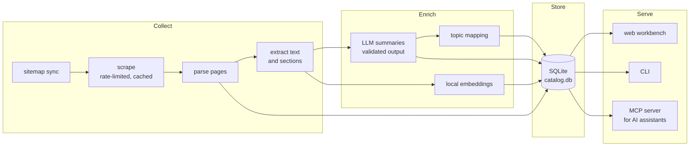

# pub-brain

A searchable, AI-readable catalog of everything MERICS has published.

## The problem

An institute's publication archive is its memory, and the website is a poor
interface to it. Site search matches keywords, not ideas. Nobody can say from
memory what was published on a topic three years ago, who has written on it,
or whether a new draft overlaps with existing work. The knowledge exists; the
recall does not.

pub-brain closes that gap. It builds a local catalog of roughly 1,300
publications from merics.org and makes them searchable three ways: exact
keywords, semantic similarity ("find pieces about this idea, however it was
phrased"), and through an AI assistant that can query the catalog directly.

Generalised from a production system in daily personal use. The published
version contains the architecture and code; the data itself is rebuilt from
public web pages by running the pipeline. Everything visible in the
screenshots and film below is public information from merics.org.

## What it does

- Crawls the publication sitemap politely (rate-limited, cached, re-runs only
  fetch what changed) and parses every page into a structured record:
  authors, type, date, topics, full body text.
- Generates a summary for each publication with an LLM: a one-line recall
  unit, a short abstract, key findings, and the named entities. Summaries
  are validated, not hoped for: an answer over the word cap is re-asked,
  never stored. Publications that exist only as an infographic go through a
  vision model instead.
- Indexes everything twice: full-text (SQLite FTS5) for exact terms, local
  vector embeddings for meaning. `find` blends both.
- Maps summaries onto a controlled topic vocabulary and lays the whole
  catalog out as a 2D landscape, so coverage and gaps are visible at a
  glance.
- Serves a local web workbench for browsing, searching, correcting and
  flagging records, and an MCP server that exposes the same queries to AI
  assistants (Claude, or anything else that speaks MCP).

## What it looks like

Hybrid search over the catalog, ranked by keyword and meaning together:


A record page: the generated summary, key findings and entities, with the
editorial controls (credit, project, flag) beside them:


The landscape: every summarised publication placed by meaning, coloured by
topic cluster. Coverage and gaps at a glance:


The 76-second registry film walks through the whole system on real data
([mp4 in full quality](docs/media/registry-film.mp4)):


## How it works



Every stage is a CLI subcommand and every stage is re-runnable: the scraper
upserts by URL, the enricher's worklist is "has text, has no summary", and an
interrupted run resumes by running the same command again. Raw HTML is cached
on disk, so improving the parser never means re-crawling the site.

## Design decisions that carry over

These are the parts worth stealing for any organisational deployment,
independent of the stack:

- **Provider-agnostic LLM layer.** One module speaks the OpenAI-compatible
  chat API; nothing else in the codebase knows which vendor is behind it.
  Swapping providers, or routing through a self-hosted gateway that holds
  the real key, is a config change. API keys live in the OS keyring or a
  `chmod 600` env file, never in the repo or a log line.
- **Validation over trust.** Model output is checked in code (word caps,
  JSON shape, entity grounding against the source text) and re-asked on
  failure. A human-written summary is a first-class row the pipeline
  refuses to overwrite.
- **Separation of fetching and parsing.** The raw cache means the expensive,
  polite part (crawling) happens once, and the cheap part (parsing) can be
  improved and re-run forever.
- **MCP as the integration surface.** The AI-assistant tools wrap the same
  query layer as the CLI and the workbench, so every interface answers
  identically, and exactly one MCP tool can write.
- **Fail-closed remote mode.** The same codebase runs on a workstation and
  on a headless server behind a tunnel. Started in remote mode without an
  auth token, the service exits instead of serving; internal-only routes are
  unregistered, not merely forbidden.

## Deployment

Runs on a workstation with no setup beyond `pip install`. The
[deploy/server/](deploy/server/) directory documents the production shape:
systemd user services on a headless box, loopback-only binding, a tunnel in
front, an access policy on the human-facing hostname and OAuth on the
assistant-facing one.

## What integrating this at MERICS would look like

The org-specific parts are exactly two: the page parser (tuned to the
current website templates) and the staff roster sync. Everything else is
generic. An institutional deployment would point the LLM layer at whatever
endpoint the organisation sanctions, run the pipeline on a schedule, and
expose the MCP server to the assistants staff already use. The workbench
then serves as the editorial control point: summaries can be corrected,
flagged and spot-checked by the people who know the content.

## Repository map

| Path | What |
|---|---|
| [pubbrain/](pubbrain/) | The package: one module per pipeline stage |
| [pubbrain/queries.py](pubbrain/queries.py) | The shared query layer behind CLI, web and MCP |
| [pubbrain/llm.py](pubbrain/llm.py) | Provider-agnostic LLM client |
| [pubbrain/mcp_server.py](pubbrain/mcp_server.py) | MCP tools for AI assistants |
| [pubbrain/web.py](pubbrain/web.py) | The local workbench (Flask) |
| [docs/schema.md](docs/schema.md) | Database schema, query traps, SQL recipes |
| [docs/cli.md](docs/cli.md) | Every pipeline command, in run order |
| [deploy/server/](deploy/server/) | Headless deployment: units, env, exposure notes |
| [tests/](tests/) | 630+ tests, run with `pytest` |

## Running it

```sh
pip install -r requirements.txt
python -m pubbrain sync-sitemap   # build the worklist
python -m pubbrain scrape         # fetch (rate-limited; --limit N for a trial)
python -m pubbrain extract-text
python -m pubbrain index-fts
python -m pubbrain find "semiconductor export controls"
```

The full pipeline, including enrichment and the workbench, is documented in
[docs/cli.md](docs/cli.md). LLM-dependent stages need an OpenAI-compatible
endpoint configured in [pubbrain/llm.py](pubbrain/llm.py) and a key in the
keyring or environment; everything else runs offline.
