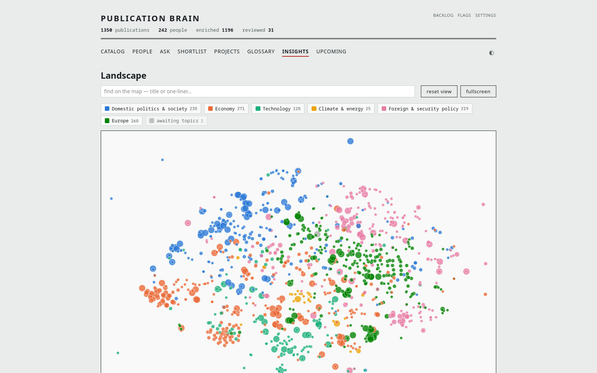
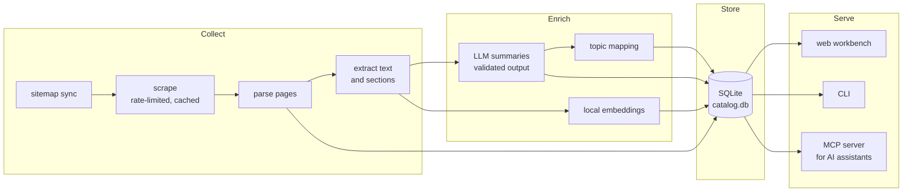

# pub-brain

A searchable, AI-readable catalog of everything MERICS has published.

## The problem

Site search on merics.org matches keywords, not ideas. Nobody can say from
memory what was published on a topic three years ago, who has written on
it, or whether a new draft overlaps with existing work.

pub-brain builds a local catalog of roughly 1,300 publications and makes
it searchable three ways: exact keywords, semantic similarity, and through
an AI assistant that queries the catalog directly.

Generalised from a production system in daily personal use. The published
version contains the architecture and code; the data itself is rebuilt from
public web pages by running the pipeline. Everything visible in the
screenshots and film below is public information from merics.org.

## What it does

- Searchable catalog of the full publication record: SQLite full-text
  search plus local vector embeddings; `find` blends both.
- LLM summary per publication (one-liner, abstract, key findings,
  entities), validated in code and re-asked when off-spec; vision model
  for infographic-only pieces.
- Topic mapping onto a controlled vocabulary; the whole catalog laid out
  as a 2D landscape.
- Local web workbench for browsing and corrections; MCP server exposing
  the same queries to AI assistants.
- Kept current by a rate-limited, cached, incremental crawl of the
  publication sitemap.

## Interface

Hybrid search, ranked by keyword and meaning together:


A record page: generated summary, key findings, entities, editorial
controls:


The landscape: every publication placed by meaning, coloured by topic:



The 76-second registry film
([mp4 in full quality](docs/media/registry-film.mp4)):


## How it works



Every stage is a CLI subcommand and every stage is re-runnable: the scraper
upserts by URL, the enricher's worklist is "has text, has no summary", and an
interrupted run resumes by running the same command again. Raw HTML is cached
on disk, so improving the parser never means re-crawling the site.

## Design decisions

- Provider-agnostic LLM layer via OpenAI-compatible API endpoints; keys in
  the OS keyring or env file, never in the repo.
- Model output validated in code (word caps, JSON shape, entity grounding)
  and re-asked on failure; human-written summaries are never overwritten.
- Fetching and parsing separated: crawl once, re-parse forever from the
  raw cache.
- One query layer behind CLI, workbench and MCP; exactly one MCP tool
  writes.
- Fail-closed remote mode: no auth token configured, no service.

## Deployment

Runs on a workstation with no setup beyond `pip install`. The
[deploy/server/](deploy/server/) directory documents the production shape:
systemd user services on a headless box, loopback-only binding, a tunnel in
front, an access policy on the human-facing hostname and OAuth on the
assistant-facing one.

## Integration at MERICS

The org-specific parts are two: the page parser and the staff roster sync.
An institutional deployment points the LLM layer at a sanctioned endpoint,
runs the pipeline on a schedule, and exposes the MCP server to the
assistants staff already use. The workbench is the editorial control
point for correcting and spot-checking summaries.

## Repository map

| Path | What |
|---|---|
| [pubbrain/](pubbrain/) | The package: one module per pipeline stage |
| [pubbrain/queries.py](pubbrain/queries.py) | The shared query layer behind CLI, web and MCP |
| [pubbrain/llm.py](pubbrain/llm.py) | Provider-agnostic LLM client |
| [pubbrain/mcp_server.py](pubbrain/mcp_server.py) | MCP tools for AI assistants |
| [pubbrain/web.py](pubbrain/web.py) | The local workbench (Flask) |
| [docs/schema.md](docs/schema.md) | Database schema, query traps, SQL recipes |
| [docs/cli.md](docs/cli.md) | Every pipeline command, in run order |
| [deploy/server/](deploy/server/) | Headless deployment: units, env, exposure notes |
| [tests/](tests/) | 630+ tests, run with `pytest` |

## Usage

```sh
pip install -r requirements.txt
python -m pubbrain sync-sitemap   # build the worklist
python -m pubbrain scrape         # fetch (rate-limited; --limit N for a trial)
python -m pubbrain extract-text
python -m pubbrain index-fts
python -m pubbrain find "semiconductor export controls"
```

The full pipeline, including enrichment and the workbench, is documented in
[docs/cli.md](docs/cli.md). LLM-dependent stages need an OpenAI-compatible
endpoint configured in [pubbrain/llm.py](pubbrain/llm.py) and a key in the
keyring or environment; everything else runs offline.
